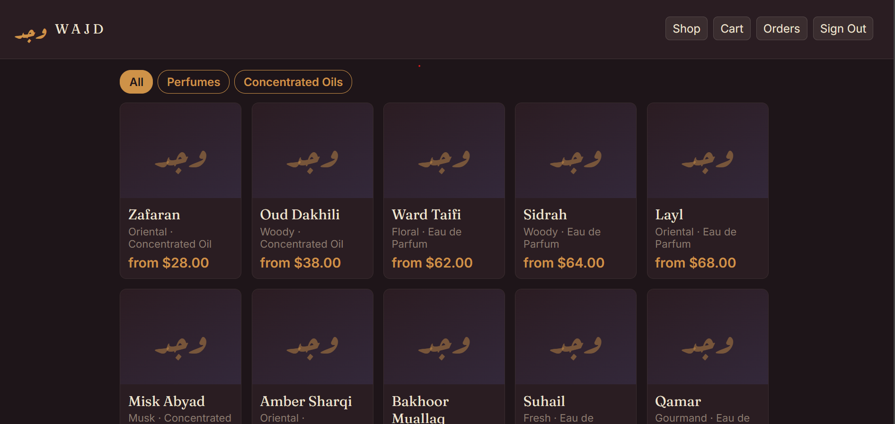
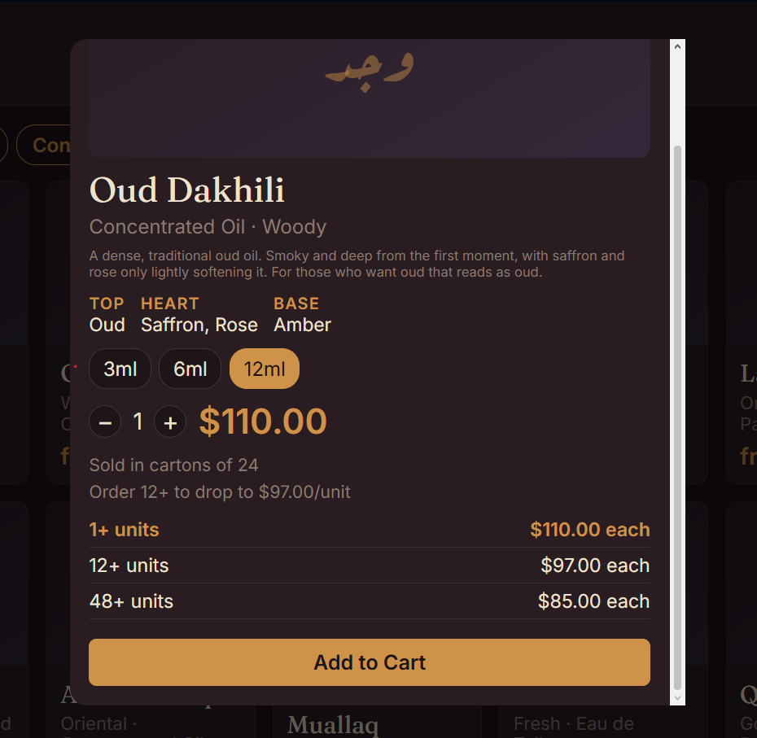
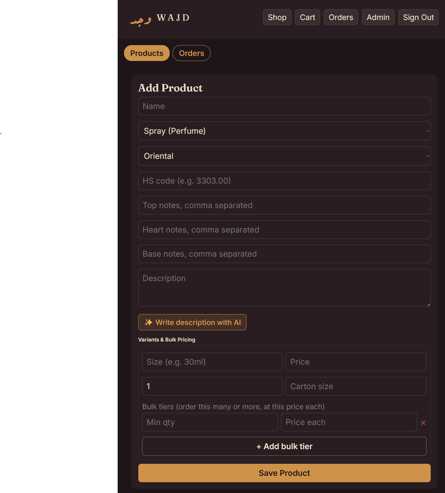

# Wajd — Fine Fragrances

**Live demo:** [wajd-fragrance-store.vercel.app](https://wajd-fragrance-store.vercel.app)
**API:** [wajd-fragrance-store.onrender.com](https://wajd-fragrance-store.onrender.com)

> The backend runs on Render's free tier, which spins down after 15 minutes of inactivity. If the demo looks slow to load the first time, that's the server waking up — give it 30-50 seconds and it'll be fast after.

A full-stack fragrance e-commerce store: perfumes and concentrated oils, quantity-based bulk pricing, an admin dashboard with an AI-powered product description writer, and import/export-ready product data (HS codes, MOQ, carton sizing).

Originally built as an attar (traditional perfume oil) shop, rebuilt here as a general fragrance retailer with a proper MERN backend and cleaner code throughout.

## Stack

- **Frontend:** React (Create React App), Firebase Auth (client SDK)
- **Backend:** Node.js, Express, MongoDB + Mongoose
- **Auth:** Firebase Authentication for identity, verified server-side on every protected route — Firebase is not used as a database anywhere in this project
- **Payments:** Stripe (test mode), COD also supported
- **AI:** Anthropic API, used for an admin-only "write this product's description" helper

## Features

- Browse by type (Perfumes / Concentrated Oils) and scent family (Woody, Floral, Oriental, etc.)
- Product detail with top/heart/base notes, size selector, and live quantity-based pricing
- **Bulk pricing tiers** — buy more, pay less per unit, same as any retail buyer; no separate "wholesale account" needed
- MOQ and carton pack size per product variant, plus HS code and country of origin — the fields an importer or distributor actually asks for
- Cart and checkout (Cash on Delivery in this demo; Stripe payment-intent endpoint is live server-side)
- Order history with cancel-while-pending
- Admin dashboard: add/remove products, set bulk tiers with server-side validation (a "discount" tier can never be priced higher than the tier below it), manage order status
- **AI description generator** — admin enters a name and a few notes, the server calls Claude to draft a short product description

## Why MongoDB instead of the original Firestore setup

The original build used Firebase/Firestore for both auth and data, despite listing Mongoose as a dependency it never used. This version uses MongoDB and Mongoose for all product and order data, and keeps Firebase strictly for what it's good at: authentication. Every admin route verifies the Firebase ID token server-side — in the original, the "admin" check only existed in the React UI and could be bypassed with a direct API call.

## Project structure

```
server/   Express API, MongoDB models, auth middleware, seed script
client/   React frontend
```

## Running locally

### Option A — one command (recommended)

From the project root:

```bash
npm run install:all   # installs both server and client dependencies
npm run dev            # runs backend and frontend together
```

This uses `concurrently` to run the Express API and the React dev server in a single terminal, color-coded (`SERVER` in blue, `CLIENT` in magenta) so you can tell which log line came from which. You still need both `.env` files set up first — see below.

### Option B — two terminals

### 1. Backend

```bash
cd server
npm install
cp .env.example .env   # fill in MongoDB URI, Firebase Admin creds, Stripe key, Anthropic key
npm run seed            # loads the starter catalog
npm run dev
```

### 2. Frontend

```bash
cd client
npm install
cp .env.example .env    # fill in API URL, Firebase web config, admin email
npm start
```

The app runs at `http://localhost:3000`, the API at `http://localhost:5000`.

## Environment variables

See `server/.env.example` and `client/.env.example` for the full list. Notably:

- `ADMIN_EMAIL` (server) / `REACT_APP_ADMIN_EMAIL` (client) — the account that gets admin dashboard access. Must match.
- `ANTHROPIC_API_KEY` is optional — without it, everything works except the AI description button.
- `FIREBASE_PRIVATE_KEY` must be the full private key from a Firebase service account JSON, not the file itself — no service account file is ever committed to this repo.

## Security notes

- No secrets are committed. `.env` and any service-account JSON are gitignored on both client and server.
- Bulk price tiers are validated server-side (auto-sorted, rejected if not actually a discount) so bad data can't be saved even by mistake.
- Order prices are computed server-side from the database at order time — a client can never submit its own price for an item.

## Screenshots





## Deployment

Live version of this project:

- **Frontend:** deployed on Vercel (Create React App build from `client/`)
- **Backend:** deployed on Render as a Node web service (`server/`, root directory set to `server`, build command `npm install`, start command `npm start`)
- **Database:** MongoDB Atlas (free M0 cluster)

Notes for anyone deploying their own copy:
- Set `CLIENT_ORIGIN` on the backend host to the exact frontend URL (not `*`) once the frontend is live, so CORS is locked down instead of wide open.
- Add the frontend's domain to Firebase Console → Authentication → Settings → Authorized domains, or login will fail on the deployed site even though it works locally.
- Render's free tier sleeps after 15 minutes idle; Railway is a paid alternative without that cold-start delay if it matters for a client demo.
